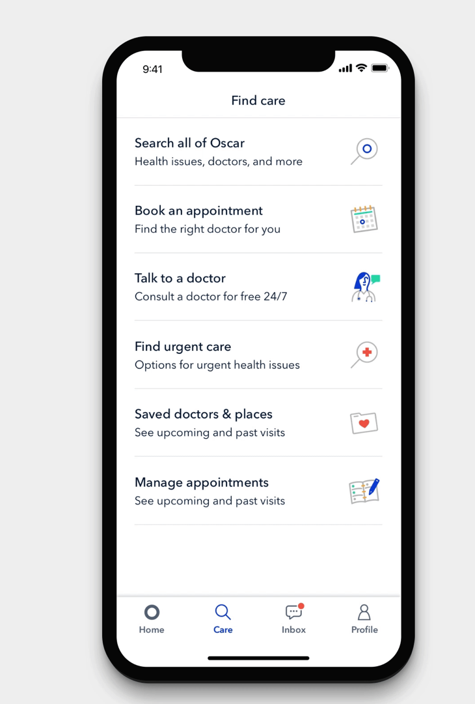
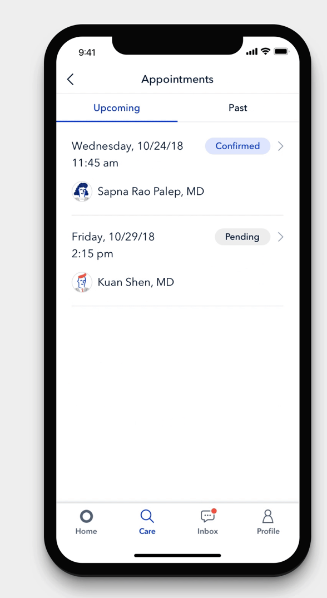
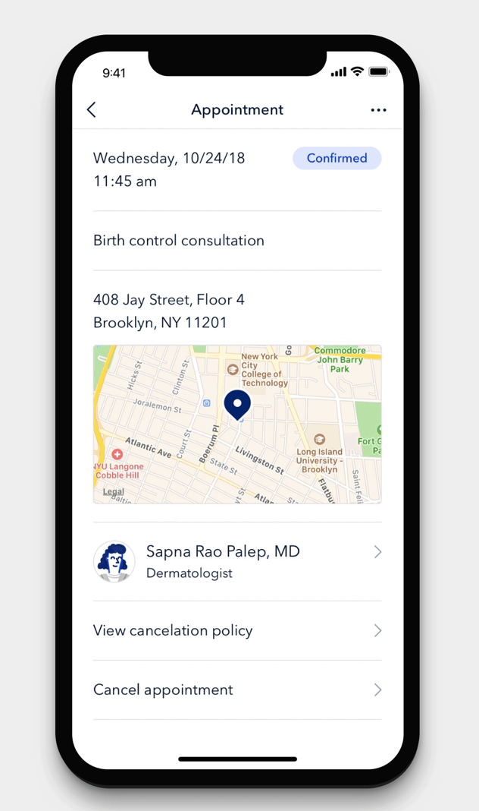
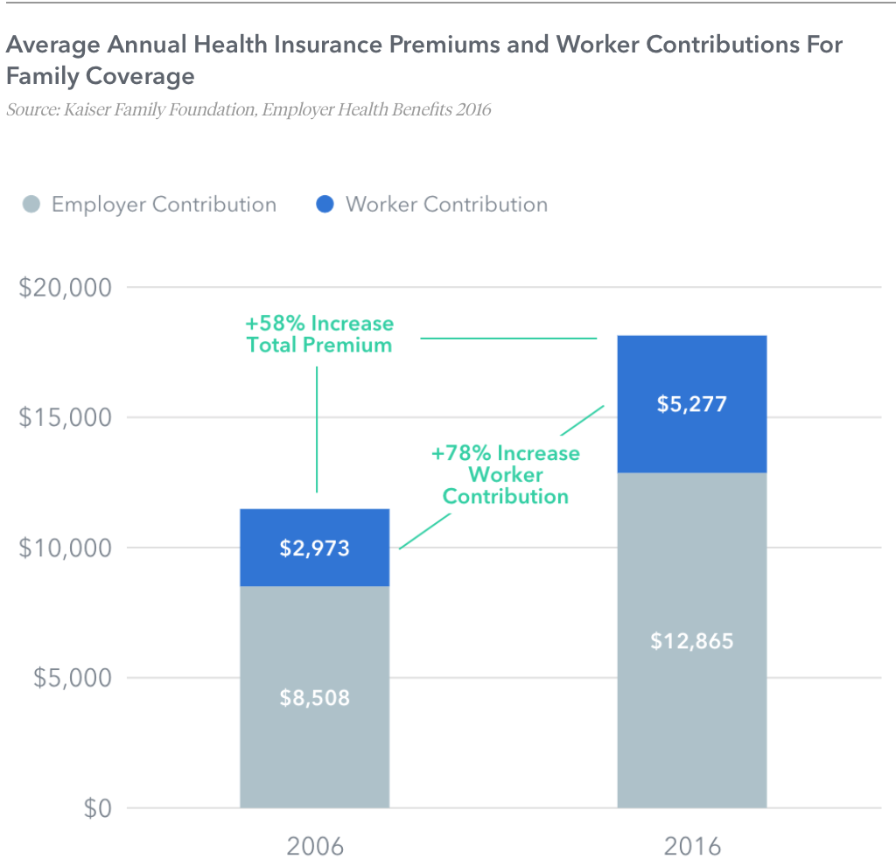
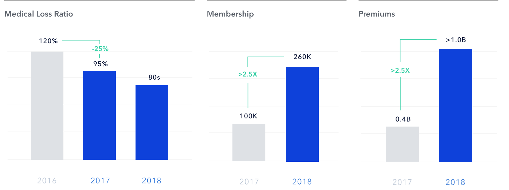

# OSCAR

# Overview and Origin 
---
* The New York-based company, founded in 2013
* 1000+ employees in New York City, Temple, Dallas, and Los Angles

* Provide consumers with health insurance via new markets created by Obamacare
* First launced in New York, New Jersey and expanded to California and Texas

* It was founded by Joshua Kushner, Mario Schlosser and Kevin Nazemi 

* In 2012, Company's CEO Mario Schlosser and his wife were going through their first pregnancy in New York. Confronted with a maze of insurance jargon and no practical was to identify the best obstetrician, their first meaningful experience with the the health care system put them at a loss as to how to navigate care or hold anyone accountable. Mario's friend and classmate from Harvard Business School, Josh Kushner, had a similar experience and they both knew that their experience were reflective of a larger problem in health care: consumers were powerless. That spring, with their classmate, Kevin Nazemi, they founded Oscar Health. The name was Kushner's great-grandfather name. 

* Oscar has raised capital through a series of funding rounds. Its investors include [Trive Capital](https://www.trivecapital.com), [General Catalyst Partners](https://www.generalcatalyst.com), [Khosla Venturs](https://www.khoslaventures.com), [Capital G](https://capitalg.com) and [Fidelity Investments](https://www.fidelity.com). 

* As of 2019, the company raised $1.3 billion, and was valued at $3.2 billion. 

 

## Business Activities

* The company simplifies the insurance procurement process. 

* facilitating communication between members and their healthcare professional (including free, on demand telephone consultations)

* Oscar is in 9 States, New York, New Jersey, California, Texas, Ohio, Tennessee, Arizona, Michigan and Florida. 

* They offer coverage in individuals, families, and small business. 

* They have 250,000 members and small business. 

* They expect to have 400,000 members by the end of the year. 

* There are 2M individuals buy their insurance online, around 7M members in business buy an insurance through health insurance company, and 22M people has Medicare Advantage. That seems to be total market Oscar is after with their current setup.

### Advantages

* Redesigned insurance to be geared toward the user experience. 
 
 * It has the most engaged in the industry. 43% of Oscar members' first visit to the doctor are routed through their technology and customer service teams. 

* It is easy for members to manage their care online. 63% of their member interactions with the health care system are virtual and 41% of their member use the company's website and mobile app every month. 

* Partnering also high-value providers. They work with 3,500 nationally ranked doctors across 140 specialities, and partnered with more than half of the top 20 health systems in the US. 

* Each member will have "Concierge Team" which is made up of a team of three care guides and a registered nurse, that handles traditional customer service questions as well as coordination of clinical care. 

* Direct appointment scheduling with a selection of its provider partners and provides application and tools to serve Oscar members, including Clinical Dashboard that pulls Oscar members' medical histories into a single platform.

Search            |  Doctor| Appointment
:-------------------------:|:-------------------------:|:-------------------------:
  | | |

* Build a predictive Models using Medicare data and their own health claims data to better optimize their patient and doctor provider network based on location, providers specialties. 

* Hosts free classes for members, such as yoga classes or classes for expectant mothers. 

# Landscape

     Domain of Financial Industry

* The company is in health insurance sector. Health insurance industry has profit margins around 3.3%.

* 36% of Americans have health insurance (Medicare & Medicaid)

* 9% are uninsured

* 58% private insurance (6% individual market, 49% coverage provided by an employer)

* Among this 49% of coverage provided by employer, 60% of them partially or fully self funded by employer, therefore they dont buy insurace from health insurance carrier. Members will have Humana, Anthem but it is the employers money that pays for claim. Insurance company just administer the benefit.

* 33% of Medicare beneficiaries enrolled Medicare Advantage plans, run by private health insurancance carries. 

* 39 states have Medicaid Managed care contracts with private carriers to cover some or all of Medicaid enrollees. 

* 25% of Medicare beneficiaries have also Medigap plans. (medicare supplement)  This covers copayments, coinsurance, deductibles of Medicare plan.

* Medical Loss Ratio: Insurers that sell individual and small group health insurance coverage must spend 80% of premiums on medical claims and quality improvements. Not more than 20 percent can be spend ont administrative costs including salaries and profits. Large group should spend 85% to the members. If you don't meet the guidelines, you send the rebate. 2012-2019, industry send $5.3 billion to consumers

* Profits are rising because growth in Medicare Advantage and Medicaid Managed care Markets. MLR ratio does not apply for Medicare and Medicaid markets, they have to win the plan from government (state government for Medicaid Managed care contracts  and federal government fow Medicare Advantage plans)
----
    Major Trends and Innovations 
----

* The technology powering health insurance is, for the most part, old and outdated, and it wasn’t built to play nicely with other systems. In the case of updating an address, for instance, a member’s online profile page may not talk to the insurer’s member database, and the member database may not talk to the claims processing system. In that case, someone has to manually update each location to reflect the new information, which is time consuming and provides ample room for errors to creep in.

* This less-than-ideal user experience has remained the status quo in health care for years. Before web-based products went mainstream, consumers just called their insurance company for help, so there was no pressing need to fix system integration issues. Now, we can access bits and pieces of our health information online—test results in a lab’s portal, prescriptions in a pharmacy portal, and claims in an insurance portal—but they’re all disconnected, leaving it up to us to tie everything together. This isn’t the seamless web experience we've come to expect.

* To catch up, the industry has to transition to modern, flexible, integrated technology. But the only way this can happen is if it’s built from the ground up, using the latest programming standards, replicating all of the complex rules and workflows currently in place, and developing strong connective tissue between each part.

___

    Other Major Companies in the Domain

___

* United Health, Kaiser Foundation, Anthem Humana, CVS, Cigna Health

## Results

* Rising health care costs are the biggest threat to the American employee and high costs are associated with uncompetitive and less transparent health care system. 

* Company created value and increased efficiency in health care by engaging the members in their own health, building an integrated virtual care platform, using technology and data science to rebuild insurance stack, delivering greater scale and transparency and designing more efficient networks, building tools to simplify the provider experience.

* Medical Loss Ratio, Membership Number and Collected Premiums are the core metrics that companies in this domain use to measure success. The company has improved on all these tree metrics.

 

. 

* The main competitor, United Health, generates revenue from variety of sources, including premiums, sales on health care products and services and investments. 79% of its revenue comes from premiums. The market capitalization went from $130b in 2014 to $240b in 2019. Oscar has a huge potential to grow over the years. 
 
 

## Recommendations

 * My number one recommendation to expand on Medicare Advantage Population. That is the most profitable section since there is no requirement for Medical Loss Ratio. 

 * Medical Advantage Population is growing every year. 

* My second recommendation to use their dataset for other fields such as outcomes research. Deidentifying the data set and providing the report for pharma industries about competitive effectiveness of their medication has been growing over the years. United health with its company called Optum works for the government and pharmaceutical industries to provide information about burden of illness, effectiveness of therapies, etc. 

* The value of the data that is collected by Oscar for providers, pharmacy and government is important. For example, hospitals can see how they perform relative to the other hospitals, pharmacy can see if their treatment reduces doctors visit, emergency room visits, etc so that they can have an idea about the value of their product. 

* Phyton, statistics programs such as R, STATA, SAS can be used for econometric modeling using the data in Oscar. 

 

# References
 
1. [Oscar uses tech to improve health care". USA Today](https://www.usatoday.com/story/tech/2015/06/24/oscar-uses-tech-to-make-consumers-less-grouchy-about-health-care/29150055/). Retrieved March 25, 2020.

 2. [Obamacare Startup Oscar Health Hits A $1.5 Billion Valuation](https://www.forbes.com/sites/stevenbertoni/2015/04/20/obamacare-startup-oscar-health-hits-a-1-5-billion-valuation/#7f5b1ec234b1). Forbes. Retrieved Retrieved March 25, 2020.

3. [Insurance start-up Oscar seeks to shake up healthcare through its app](https://www.latimes.com/business/la-fi-cutting-edge-oscar-20151018-story.html). Los Angeles Times. ISSN 0458-3035. Retrieved March 26, 2020
 
4. [Can three technologists, $40 million, and Obamacare change health insurance forever?](https://www.washingtonpost.com/news/wonk/wp/2013/07/26/can-three-technologists-40-million-and-obamacare-change-health-insurance-forever/). Washington Post. Retrieved March 26, 2020

5. [How Health Insurance Startup Oscar Is Going to Get to 1 Million Members.](https://www.bloomberg.com/news/articles/2016-02-19/health-startup-oscar-shifts-tack-in-bid-for-million-customersBloomberg)   Retrieved March 26, 2020.
 
 
6. [Take a look inside the doctor's office of the future, created by a $2 billion startup that's shaking up healthcare.](https://www.businessinsider.com/oscar-center-a-tour-inside-the-doctors-office-of-the-future-photos-2016-12) Business Insider. Retrieved March 26, 2020.

 
7. [Oscar is Disrupting Health Care in a Hurricane.](https://backchannel.com/oscar-is-disrupting-health-care-in-a-hurricane-65480bfed940) WIRED. Retrieved March 25, 2020.
 
8.  [Say Hi To Oscar: The New Kid That May Change Health Insurance".](https://www.forbes.com/sites/theapothecary/2013/08/19/say-hi-to-oscar-the-new-kid-that-may-change-health-insurance/#79cd37765a92). Retrieved March 25, 2020.
 
9. [A Google-backed health insurer wants to disrupt insurance by ... limiting patient choice?". Vox.](https://www.vox.com/2016/7/26/12257926/oscar-health-networks-new-york)  Retrieved March 25, 2020.

10. [Top startups disrupting the healthcare insurance industry.](https://vator.tv/news/2019-10-07-top-startups-distrupting-the-healthcare-insurance-industry) Vator. Retrieved March 25, 2020. 

10. [Oscar](https://www.hioscar.com) Retrieved OMarch 25, 2020. 